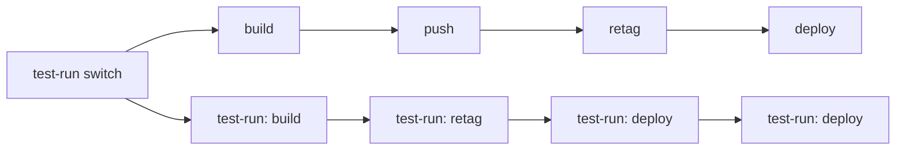

# `.github/` conventions

This document describes the conventions used by the workflows in
`.github/workflows/` and the composite actions in `.github/actions/`.
Most of them look like duplication or footguns at first glance — they aren't.
Read this before "simplifying" anything here.

# TL;DR

Every workflow:

1. Must have 3 ways to run with exactly the same steps and env variables definitions:
    1. Locally with `nektos/act`
    2. On GitHub Actions using `workflow_dispatch` with `inputs.test_run`
    3. Default production run
2. Must define `env:` sections in job's scope that map `secrets.*` and `vars.*` into named env vars
3. Must use only variables from the closest `env:` block or `github.*` context in `steps:` section
4. Must only use variables from `env:` blocks via `${{ env.* }}`
5. Must not use `test_run` for branching in `steps:` sections. Steps must not know whether they're
   running in test-run mode or not.
6. Must use test_run mode if running locally with `nektos/act`.

Workflows are strictly divided into CI and CD parts.

CI workflows:

1. Must not use a pre/production environment in any way.
2. Must use only GHCR.io artifactory, which is considered a part of the development environment.
3. Must not create tags or releases.

CD workflows:

1. Must have `cd-` prefix in the name.
2. Must be triggered by a release or workflow_dispatch events.
3. Must not be triggered by a push event of any kind, including tags.
4. Must use a pre/production environment in default mode.
5. Must not use a pre/production environment in test-run mode, only test-run environment.
6. Must only pull Docker images from GHCR.io, never push to GHCR.io.
7. Must only pull Docker images from GHCR.io with `ghcr.io/${{ github.repository }}` path prefix and tags, related to
   the release it was triggered by – either the release tag or commit SHA.
8. Must never use GHCR.io directly to push to pre/production environments. Must always create a copy of the image
   in the environment it deploys to.
9. Must never delete any image from pre/production environments.

# Workflows

<details>
<summary>An example:</summary>

```yaml

name: CI - push to ghcr.io
on:
  push:
    tags:
      - 'v*.*.*'
  workflow_dispatch:
    inputs:
      test_run:
        description: Test run
        type: boolean
        default: true

jobs:
  switch:
    name: Test-run switch
    runs-on: ubuntu-latest
    outputs:
      test_run: ${{ steps.test_run.outputs.test_run }}
    steps:
      - uses: actions/checkout@v6
      - id: test_run
        uses: ./.github/actions/test_run
        with:
          test_run: ${{ inputs.test_run }}

  build-and-push:
    name: Build and push ZPCG image
    needs: switch
    if: needs.switch.outputs.test_run != 'true'
    runs-on: ubuntu-latest
    permissions:
      contents: read
      packages: write
      id-token: write
    environment: dev
    env: &build-and-push-env
      IMAGE_TAG_SHA: ${{ vars.ENV_REGISTRY }}/${{ github.repository }}:${{ github.sha }}
      IMAGE_TAG_TAG: ${{ vars.ENV_REGISTRY }}/${{ github.repository }}:${{ github.ref_name }}
    steps: &build-and-push-steps
      - uses: actions/checkout@v6

      - name: Login to GHCR
        uses: docker/login-action@v4
        with:
          registry: ghcr.io
          username: ${{ github.actor }}
          password: ${{ github.token }}

      - name: Build image
        uses: docker/build-push-action@v7
        with:
          context: .
          file: deploy/Dockerfile
          load: 'true'
          tags: |
            ${{ env.IMAGE_TAG_SHA }}
            ${{ env.IMAGE_TAG_TAG }}

      - name: Push
        run: |
          docker push ${{ env.IMAGE_TAG_SHA }}
          docker push ${{ env.IMAGE_TAG_TAG }}

  build-and-push-test-run:
    name: Build CI image (test-run)
    needs: switch
    if: needs.switch.outputs.test_run == 'true'
    runs-on: ubuntu-latest
    environment: test-run
    permissions:
      contents: read
      packages: read # <-- test-run mode
      id-token: write
    env: *build-and-push-env
    steps: *build-and-push-steps


```

</details>

## CI vs CD

The split is: **CI writes only to GHCR; CD reads from GHCR and writes to production-grade registries**.

| Workflow | Trigger | Category |
|---|---|---|
| `pr-checks.yml` | PR, push to `main` | CI |
| `ci.yml` | Tag push `v*.*.*` | CI |
| `golang-tdlib-image-build.yml` | `workflow_dispatch` | CI |
| `cd-pre-release.yml` | GitHub prerelease | CD |

**CI** workflows run checks and build Docker images to GHCR.io only. They never authenticate to GCP
or touch any production environment. `pr-checks.yml` runs build/test/lint on every PR and push to
`main`. `ci.yml` builds the ZPCG image and pushes it to `ghcr.io/<repo>:<sha>` and
`ghcr.io/<repo>:<tag>`. `golang-tdlib-image-build.yml` builds the base TDLib image that test and lint
jobs use as their container.

**CD** workflows (`cd-pre-release.yml`) pull the CI-built image from GHCR, retag it into the target
environment's Artifact Registry, and deploy to Cloud Run. CD is gated behind a GitHub release event —
a deliberate, human-initiated action. CD never builds images; it only retags and deploys.

Typical end-to-end flow for a prerelease:

1. Developer pushes tag `v1.2.3-rc.1` → `ci.yml` builds and pushes `ghcr.io/<repo>:<sha>` and
   `ghcr.io/<repo>:v1.2.3-rc.1` to GHCR.
2. Developer creates a GitHub prerelease from that tag → `cd-pre-release.yml` pulls from GHCR,
   retags to `<preprod-registry>/<repo>:<sha>` and `:<tag>`, and deploys to Cloud Run preprod.

GHCR is always the intermediate artifact store. CD never rebuilds from source.

## `env:` blocks

```yaml

env:
  GLOBAL_ENV_VAR: value

jobs:
  - job1:
      env: # maps outside secrets and vars to job-scoped env vars
        - DOESNT_WORK: ${{ env.GLOBAL_ENV_VAR }} # <-- substitution from global env: DOESN'T WORK in ACT
        - JOB1_VAR2: ${{ secrets.GLOBAL_SECRET }}
        - JOB1_VAR2: ${{ vars.GLOBAL_VAR }}
      steps:
        - run: |
            LOCAL_VAR=${{ env.JOB1_VAR }} # explicitly shows that env.JOB1_VAR is defined in job1's env: section
            LOCAL_VAR2=LOCAL_VAR          # explicitly shows that LOCAL_VAR is a local variable
```

Each job declares an `env:` block that maps `secrets.*` and `vars.*` into named env vars. Steps then reference only
`${{ env.* }}` in `with:` and `run:` blocks — never `secrets.*` or `vars.*` directly. The benefit is that each step is a
**self-contained block** — to understand
or edit a step you don't have to scroll up and cross-reference secret/var definitions.

## Test-run model

Workflow diagram with a test-run switch:



Implementation:

```yaml
jobs:
  - switch:
      outputs:
        test_run: ${{ steps.test_run_switch.outputs.test_run }} # true or false
      steps:
        - # decide - default or test-run
        - # set outputs.test_run to true or false 
  - build:
      name: Deploy to preprod
      needs: [ switch ]
      if: ${{ needs.switch.outputs.test_run != 'true' }} # depends on switch
      env: &build-env       # env anchor
      # ...
      steps: &build-steps   # steps anchor
      # ...

  - deploy-test-run:
      name: (test-run) Deploy to preprod
      needs: [ switch ]
      if: ${{ needs.switch.outputs.test_run == 'true' }}
      environment: test-run # test environment
      permissions:
        registry: read      # protects from accidental writes
      env: *build-env       # same envs
      steps: *build-steps   # same steps
```

Production and test-run jobs are deployed as **parallel pairs** that share a YAML-anchor step list
(e.g. `*build-and-push-steps`, `*retag-steps`, `*deploy-steps`). The pair is selected by
`needs.switch.outputs.test_run`. Both jobs run the **same steps**.

Safety comes from `environment: test-run` resolving secrets and vars to non-production targets —
for example `vars.ENV_REGISTRY` resolves to a public no-auth sink like `ttl.sh` in the test-run
environment, and WIF credentials resolve to a test-run GCP project. Reduced `permissions:`
(e.g. `packages: read` on GHCR) provide a second layer.

This means a step that "actually runs" in the test-run job is fine, as long as its destination
comes from environment-scoped secrets or vars. Do **not** add step-level `if:` skips to make
test-run steps "no-op" — that defeats the purpose of exercising the same code path.

The one exception is `golang-tdlib-image-build.yml`'s Push step, see below.

### Outputs don't work

In GitHub Actions, **outputs from skipped jobs are always empty strings** — they are not propagated
to downstream `needs`. This is a problem for the mutually exclusive test-run pair: exactly one of
`retag` / `retag-test-run` runs and the other is skipped. If `deploy` referenced
`needs.retag.outputs.image_tag` directly, it would receive an empty string in test-run mode (because
`retag` was skipped).

The `retag-out` fan-in job works around this. It uses `!cancelled()` and `result` checks in its `if:`
so it always runs as long as one of the pair succeeded. It then picks the non-empty output with `||`:

```yaml
image_tag: ${{ needs.retag.outputs.image_tag || needs.retag-test-run.outputs.image_tag }}
```

Because `retag-out` itself is not skipped, its output is always populated. `deploy` then only needs
`needs.retag-out.outputs.image_tag` — no conditional logic required.

`cd-pre-release.yml`'s `retag-out` job (lines ~94-102) is the concrete example. Its only role is to
coalesce `outputs.image_tag` from the two mutually-exclusive `retag` and `retag-test-run` jobs into
a single output that the `deploy` job can consume. It looks like a no-op but it is **load-bearing**:
without it, the `deploy` job would need conditional logic to pick the right upstream, and the
test-run path would break.

### `golang-tdlib-image-build.yml` Push step exception

This workflow's `build-and-push` job has a step-level `if:` skip on the Push step:

```yaml
- name: Push
  if: ${{ needs.switch.outputs.test_run != 'true' }}
  run: docker push ${{ env.IMAGE_TAG }}
```

This is the one place where a step-level skip is intentional. In all other workflows, test-run
safety comes from `vars.ENV_REGISTRY` resolving to a no-auth sink (e.g. `ttl.sh`) in the
`test-run` GitHub environment, so the push step runs but writes to a harmless destination.
That redirect cannot be applied here: the tdlib image tag is always
`ghcr.io/<repo>/tdlib:<commit>` — a hardcoded GHCR path that does not change between environments.
There is no environment variable to point at a test-run sink, so skipping the push is the only
safe option.
