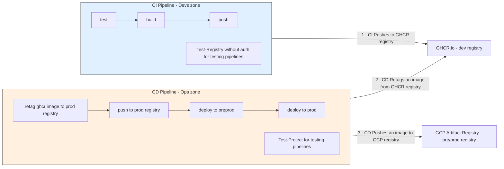
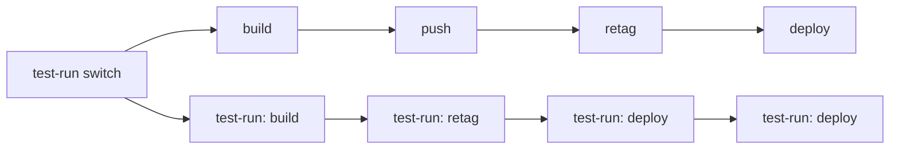
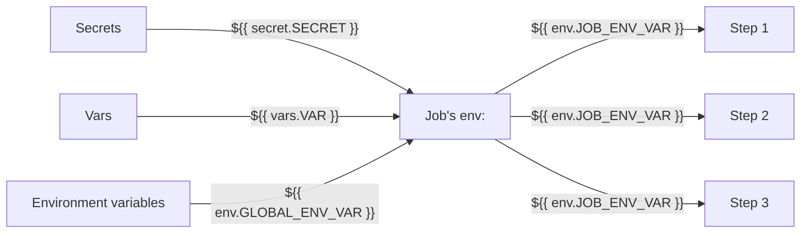

# `.github/` conventions

This document describes the conventions used by the workflows in
`.github/workflows/` and the composite actions in `.github/actions/`.

# TL;DR

Every workflow:

1. Must have 3 ways to run with exactly the same steps and env variables definitions:
    1. Locally with `nektos/act`
    2. On GitHub Actions using `workflow_dispatch` with `inputs.test_run`
    3. Default production run
2. Must define `env:` sections in job's scope that map `secrets.*` and `vars.*` into named env vars
3. Must use only variables from the closest `env:` block or `github.*` context in `steps:` section
4. Must only use variables from `env:` blocks via `${{ env.* }}`
5. Must not use `test_run` for branching in `steps:` sections. Steps must not know whether they're
   running in test-run mode or not.
6. Must use test_run mode if running locally with `nektos/act`.
7. Must never run automatically on every commit, except for protected branches and the default one. For PR checks
   require manual approval, do not run workflows on every push.
8. Must have a matching `test-<name>` target in the root `Makefile`, listed as a prerequisite of
   `test-all-workflows`. The target runs `act` with the workflow file and the corresponding
   `test-run` input.

Workflows are strictly divided into CI and CD parts.

CI workflows:

1. Must have `ci-` prefix in the name.
2. Must not use a pre/production environment in any way.
3. Must use only GHCR.io artifactory, which is considered a part of the development environment.
4. Must not create tags or releases.

CD workflows:

1. Must have `cd-` prefix in the name.
2. Must be triggered by a release or workflow_dispatch events.
3. Must not be triggered by a push event of any kind, including tags.
4. Must use a pre/production environment in default mode.
5. Must not use a pre/production environment in test-run mode, only test-run environment.
6. Must only pull Docker images from GHCR.io, never push to GHCR.io.
7. Must only pull Docker images from GHCR.io with `ghcr.io/${{ github.repository }}` path prefix and tags, related to
   the release it was triggered by – either the release tag or commit SHA.
8. Must never use GHCR.io directly to push to pre/production environments. Must always create a copy of the image
   in the environment it deploys to.
9. Must never delete any image from pre/production environments.
10. Must never touch any source code. Only pull release-ready artifacts.

Actions:

1. Use it to abstract away similar steps across workflows. Do not copy-paste steps, use actions instead.
2. Must use $GITHUB_STEP_SUMMARY to simplify debugging and improve visibility into what happened during the step.
3. Must use duplicate step summary to stdout for easier debugging with `act`. Step summary is unavailble in local runs
   with `nektos/act`.
4. Must use workflow commands (`::error...`, `::warning...`, `::debug...`, `::group...`, etc.) to simplify understanding
   of what happened during the step.

# Workflows

<details>
<summary>An example:</summary>

```yaml

name: CI - push to ghcr.io
on:
  push:
    tags:
      - 'v*.*.*'
  workflow_dispatch:
    inputs:
      test_run:
        description: Test run
        type: boolean
        default: true

jobs:
  switch:
    name: Test-run switch
    runs-on: ubuntu-latest
    outputs:
      test_run: ${{ steps.test_run.outputs.test_run }}
    steps:
      - uses: actions/checkout@v6
      - id: test_run
        uses: ./.github/actions/test_run
        with:
          test_run: ${{ inputs.test_run }}

  build-and-push:
    name: Build and push ZPCG image
    needs: switch
    if: needs.switch.outputs.test_run != 'true'
    runs-on: ubuntu-latest
    permissions:
      contents: read
      packages: write
      id-token: write
    environment: dev
    env: &build-and-push-env
      IMAGE_TAG_SHA: ${{ vars.ENV_REGISTRY }}/${{ github.repository }}:${{ github.sha }}
      IMAGE_TAG_TAG: ${{ vars.ENV_REGISTRY }}/${{ github.repository }}:${{ github.ref_name }}
    steps: &build-and-push-steps
      - uses: actions/checkout@v6

      - name: Login to GHCR
        uses: docker/login-action@v4
        with:
          registry: ghcr.io
          username: ${{ github.actor }}
          password: ${{ github.token }}

      - name: Build image
        uses: docker/build-push-action@v7
        with:
          context: .
          file: deploy/Dockerfile
          load: 'true'
          tags: |
            ${{ env.IMAGE_TAG_SHA }}
            ${{ env.IMAGE_TAG_TAG }}

      - name: Push
        run: |
          docker push ${{ env.IMAGE_TAG_SHA }}
          docker push ${{ env.IMAGE_TAG_TAG }}

  build-and-push-test-run:
    name: Build CI image (test-run)
    needs: switch
    if: needs.switch.outputs.test_run == 'true'
    runs-on: ubuntu-latest
    environment: test-run
    permissions:
      contents: read
      packages: read # <-- test-run mode
      id-token: write
    env: *build-and-push-env
    steps: *build-and-push-steps


```

</details>

## CI vs CD

The split is: **CI writes only to GHCR; CD reads from GHCR and writes to production-grade registries**.



**CI** workflows run checks and build Docker images to GHCR.io only. They never authenticate to GCP
or touch any production environment. `pr-checks.yml` runs build/test/lint on every PR and push to
`main`. `ci.yml` builds the ZPCG image and pushes it to `ghcr.io/<repo>:<sha>` and
`ghcr.io/<repo>:<tag>`. `ci-pr-checks-image-build.yml` builds the base TDLib image that test and lint
jobs use as their container.

**CD** workflows (`cd-pre-release.yml`) pull the CI-built image from GHCR, retag it into the target
environment's Artifact Registry, and deploy to Cloud Run. CD is gated behind a GitHub release event —
a deliberate, human-initiated action. CD never builds images; it only retags and deploys.

Typical end-to-end flow for a prerelease:

1. Developer pushes tag `v1.2.3-rc.1` → `ci.yml` builds and pushes `ghcr.io/<repo>:<sha>` and
   `ghcr.io/<repo>:v1.2.3-rc.1` to GHCR.
2. Developer (or someone from an Ops team) creates a GitHub prerelease from that tag → `cd-pre-release.yml` pulls from
   GHCR, retags to `<preprod-registry>/<repo>:<sha>` and `:<tag>`, and deploys to Cloud Run pre/prod.

GHCR is always the intermediate artifact store. CD never rebuilds from source.

## Test-run model

Workflow diagram with a test-run switch:



Implementation:

```yaml
jobs:
  - switch:
      outputs:
        test_run: ${{ steps.test_run_switch.outputs.test_run }} # true or false
      steps:
        - # decide - default or test-run mode
        - # set outputs.test_run to true or false 
  - deploy:
      name: Deploy to preprod
      needs: [ switch ]
      if: ${{ needs.switch.outputs.test_run != 'true' }} # depends on the switch
      env: &deploy-env        # env anchor
      # ...
      steps: &deploy-steps    # steps anchor
      # ...

  - deploy-test-run:
      name: (test-run) Deploy to preprod
      needs: [ switch ]
      if: ${{ needs.switch.outputs.test_run == 'true' }}
      environment: test-run   # test environment
      permissions:
         registry: read       # protects from accidental writes
      env: *deploy-env        # same envs
      steps: *deploy-steps    # same steps
```

Production and test-run jobs are deployed as **parallel pairs** that share a YAML-anchor step list
(e.g. `*build-and-push-steps`, `*retag-steps`, `*deploy-steps`). The pair is selected by
`needs.switch.outputs.test_run`. Both jobs run the **same steps**.

Safety comes from `environment: test-run` resolving secrets and vars to non-production targets —
for example `vars.ENV_REGISTRY` resolves to a public no-auth sink like `ttl.sh` in the test-run
environment, and WIF credentials resolve to a test-run GCP project. Reduced `permissions:`
(e.g. `packages: read` on GHCR) provide a second layer.

```yaml
  - deploy:
       # ...
       env: &deploy-env
          - ENV_REGISTRY: ${{ vars.ENV_REGISTRY }}
       steps: &deploy-steps
          - docker push ${{ env.ENV_REGISTRY }}/image:tag

  - deploy-test-run:
       # ...       
       environment: test-run
       permissions:
          registry: read
       env: *deploy-env
       steps: *deploy-steps    # same 'docker push', but to a test-run registry
```

This means a step that "actually runs" in the test-run job is fine, as long as its destination
comes from environment-scoped secrets or vars. Do **not** add step-level `if:` skips to make
test-run steps "no-op" — that defeats the purpose of exercising the same code path.

### Outputs don't work

```yaml
   - build:
        # ... 
        outputs: &push-outputs
           image:
              description: Docker image ID of the built image
              value: ${{ steps.build.outputs.image }}

   - build-test-run:
        # ...
        outputs: *push-outputs # same outputs

   - push:
        # ...
        needs: [ build ]
        env: &push-env
           - IMAGE_TAG: ${{ needs.build.outputs.image }}

   - push-test-run:
        # ...
        needs: [ build-test-run ]
        env: *push-env # gets IMAGE_TAG from 'build', not 'build-test-run' !!!

```

Take a look at the last line - `env:` block in `push-test-run` job references `needs.build.outputs.image`
but actually needs `needs.build-test-run.outputs.image`.

Fix it by duplicating the `env:` block. Pair each downstream job with its matching upstream
sibling directly, copy the `env:` section, and keep the steps anchor — the only line that differs
is the one that reads the upstream output:

```yaml
   - push:
        # ...
        needs: [ build ]
        env: &push-env
           - IMAGE_TAG: ${{ needs.build.outputs.image }}
        steps: &push-steps
        # ...     

   - push-test-run:
        # ...
        needs: [ build-test-run ]
        env:
           - IMAGE_TAG: ${{ needs.build-test-run.outputs.image }} # but be careful when editing 
        steps: *push-steps
```

## Hide global var references in `env:` blocks



Each job declares an `env:` block that maps `secrets.*` and `vars.*` into named env vars. Steps then reference only
`${{ env.* }}` in `with:` and `run:` blocks — never `secrets.*` or `vars.*` directly. The benefit is that each step is a
**self-contained block** — to understand or edit a step you don't have to scroll up and cross-reference secret/var
definitions.

```yaml

env:
   GLOBAL_ENV_VAR: value

jobs:
   - job1:
        env: # maps outside secrets and vars to job-scoped env vars
           - DOESNT_WORK: ${{ env.GLOBAL_ENV_VAR }} # <-- substitution from global env: DOESN'T WORK in ACT
           - JOB1_VAR2: ${{ secrets.GLOBAL_SECRET }}
           - JOB1_VAR2: ${{ vars.GLOBAL_VAR }}
        steps:
           - run: |
                LOCAL_VAR=${{ env.JOB1_VAR }} # explicitly shows that env.JOB1_VAR is defined in job1's env: section
                LOCAL_VAR2=LOCAL_VAR          # explicitly shows that LOCAL_VAR is a local variable
```

## Running tests and linters

### Local testing with `nektos/act`

Every workflow must have a `test-<name>` target in the root `Makefile`. Let's see an example.

The `ci-pr-checks` workflow is intended to be run on every PR, checking validity of every change before
it's merged into the main branch. Then, its test case must look like this:

```makefile
ACT ?= gh act

.PHONY: test-ci-pr-checks
test-ci-pr-checks:
	$(ACT) pull_request \                         # on pull_request event
		-W .github/workflows/ci-pr-checks.yml \   # run ci-pr-checks
		--secret-file .github/act/secret.env \    # with local secrets
		--var-file .github/act/var.env            # and vars
```

Another example - `cd-pre-release` workflow.

```makefile
ACT ?= gh act

GCLOUD_SCOPE := https://www.googleapis.com/auth/cloud-platform.read-only
# lazy evaluation for gcloud token with read-only scope
GCLOUD_TOKEN = $(eval GCLOUD_TOKEN := $(shell gcloud auth print-access-token --scopes='$(GCLOUD_SCOPE)'))$(GCLOUD_TOKEN)

.PHONY: test-cd-pre-release
test-cd-pre-release:
    $(ACT) release \                                    # on release 
        -W .github/workflows/cd-pre-release.yml \       # run cd-pre-release   
        -e .github/act/event-release-prerelease.json \  # with release event payload, containing release tag and preprelease = true    
        --secret-file .github/act/secret.env \          # with local secrets
        --var-file .github/act/var.env \                # vars
        --env CLOUDSDK_AUTH_ACCESS_TOKEN=$(GCLOUD_TOKEN)# and lazily evaluated gcloud token with read-only scope. 
```

Both of the targets can be run in dry-run mode with `act -n`:

```shell
make test-ci-pr-checks ACT="act -n"
make test-cd-pre-release ACT="act -n" GCLOUD_TOKEN=without-token-evaluation
```

**When you add or rename a workflow under `.github/workflows/`:**

1. Add or rename the matching `test-<workflow-name>` target in `Makefile`, mirroring
   the existing ones (`$(ACT) <event> -W .github/workflows/<file>.yml …`).
2. List the target as a prerequisite of `test-all-workflows`.

Nothing else catches a missing test target — `act` only lints the workflows it's
explicitly pointed at.

### CI linting with `rhysd/actionlint`

`rhysd/actionlint` is a static checker for GitHub Actions workflows. It's used in `ci-pr-checks`:

```yaml
    # ...
    steps:
       - uses: actions/checkout@v6
       - name: Lint all workflows
         run: actionlint
```
