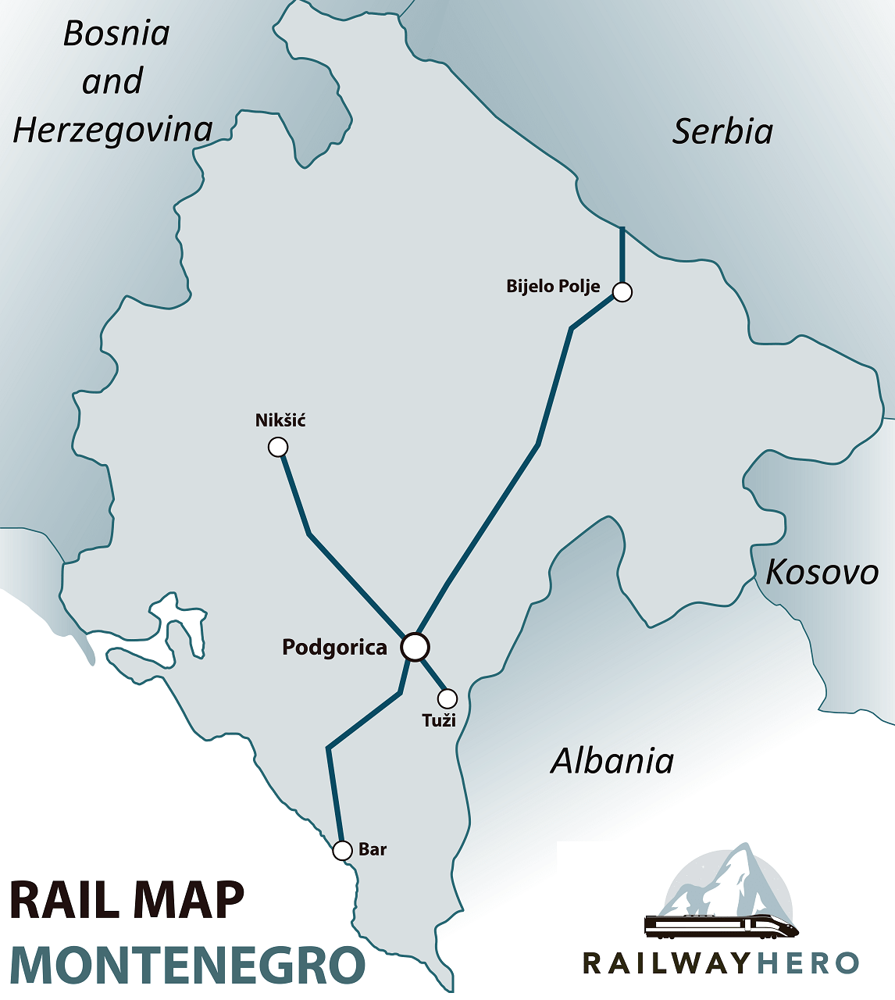

# Montenegro Railways Timetable Bot

A Telegram bot that simplifies finding train schedules in Montenegro.

**[@Monterails_bot](https://t.me/Monterails_bot)**

# Why

Original timetable - https://zpcg.me/search

The site does not have a mobile version, pretty hard to navigate and can't show intersection routes.
This bot is an attempt to solve those issues.

## Requirements

1. Ensure it's straightforward and user-friendly to the greatest extent possible
   1. ✅ Provides a menu with all the supported commands
   2. ✅ Has a start message with laconic and complete description of how to get the timetable
   3. ✅ Returns the requested timetable even if the user made a typo
   4. ✅ In case of an error returns message with a detailed description of how to resolve the issue
   5. ✅ Has enough logging to check if the users reach their goals
   6. ❌ Recognizes latin and cyrillic alphabet
   7. ❌ Provides button interface for the most used stations
   8. ❌ Provides additional information:
      1. ❌ Price and discounts
      2. ❌ Marks trains as local/fast
      3. ❌ Stations location, ticket office availability
      4. ❌ Official website links
      5. ❌ Last update time
2. Has a full, updated timetable
   1. ✅ Parses original website automatically
   2. ✅ Knows every single station
   3. ❌ Updates timetable automatically (right now the updates are triggered manually, without schedule)
   4. ❌ Updates timetable only if needed (checks if there are any changes on the official website)
3. ✅ Cost-effective as much as possible
   1. ✅ Runs in the cloud
   2. ✅ Uses tg webhooks
   3. ✅ Scales up/down automatically
   4. ✅ Runs on 1~2 thread cpus with minimum RAM available on the cloud
   5. ✅ Uses only in-memory storage, no external database or cache
   6. ✅ Fully stateless, no persistence at all

## Known issues

### Input format

Right now the bot requires an input in a certain way explained in the [Interface section](#timetable-request).

This is a too strict format that makes some issue for users:

- Sometimes users use other delimiters instead of a comma - and the bot returns an error.
  Example: "Beograd - Podgorica"
- Some users (russian and serbian speakers for examples) prefer cyrillic characters, like:
  "Белград, Подгорица" or "Београд, Подгорица"
- Some users copy the route from the previously sent messages in order to get a new timetable, like:
  "Virpazar > Podgorica > Niksic"

All those inputs might be parsed easily anyway. 

The solution:
1. Get the user input string
2. Remove all the spaces
3. Split the string using any non-alphanumeric characters as separators
4. If there are less than 2 parts in the result of the splitting - return error
5. Take the first and the last part of the result as a departure and an arrival station
6. Convert cyrillic chars to latin ones
7. Pass further to the existing pipeline

### Cached keyboard from the previous version

Telegram allows developers to use keyboards. However, it is cached in the users device telegram
instance. Even though if it is no longer supported, the users might still
attempt to use an old cached version of the keyboard.
As a remedy, the keyboard is deleted with the first message received from
the new version. For an efficient cleanup, consider clearing the cached keyboard with
a broadcast update message.

It might be a good idea to clear the cached keyboard with a broadcast update message.
It might be also a good idea to do so after the new keyboard will be done in order to send only
one message instead of two.

### No general information about Montenegro Railways

Some users are not familiar at all with the transport in Montenegro:
do not know where the railways stations are, which cities have stations, etc.
It leads users to blindly search for the stations that do not exist. There are some examples of the inputs:

- "Sarajevo, Belgrad" - Sarajevo is the capital of Bosnia and Herzegovina,
  Belgrade - the capital of Serbia. Why the users search those stations in the **Montenegro** Bot?
- "Albania, Podgorica" - Albania is a country, not a city. Obviously, the user tried to find out are
  there any ways to get from the Albania to the Podgorica by a train.
- "Podgorica, Milan" - the same 
- "Таганрог, Ростов Главный" - I'm not joking, that's the real input. And furthermore - the same
  user tried to find this route 4 times with different inputs

I think there should be some kind of `/help` command to return some general information
about the bot, Montenegro and the transport.

### Low trust in the output

Previous version of the bot was completely static, made in an hour using a free telegram bot constructor
with hardcoded timetable. It was truly obvious that the timetable was not updated
and might be (and actually was) outdated. So users have those trust issues now and the bot has to
overcome this.

There has to be:
- The timetable last update time
- Inline button to update it manually
- Links to the official site 

### Trains are frequently running late

There has to be a warning about possible delays especially for routes with intersections, in summer and
for the fast trains - they are usually late for several hours, unfortunately.

# Solution details

The current solution uses a lot of assumptions in order to make it cost-effective and fast.

## Interface

### /start

`/start` is the first message the bot receives after the user starts the bot. It returns a quick,
laconic instructions of how to use the bot.

Returns the message in the different language depending on the users telegram settings.
If the users language is not supported - it uses English to communicate.

### Timetable request

Any message without a `/` in it is parsed as a timetable request.

The expected format is
`{departure station name using only latin characters} {',' or '>' symbol}
{arrival station name using only latin characters}`.

Messages in the expected format are replayed with a timetable. Any other - an error.

The default error is defined in `/internal/service/render/{language_code}.go` files.

If the input message is in the right format but contains a station name from the black list defined in
`/internal/service/blacklist` - it will be responded with a custom warning usually telling the user
that the station does not exist.

#### No intersections

Response with a route without an intersection is in the following format:

```
 Podgorica > Danilovgrad
[7100](https://zpcg.me/details?timetable=201#tab3) 08:00 > 08:29 
[7102](https://zpcg.me/details?timetable=202#tab3) 12:50 > 13:19 
[7104](https://zpcg.me/details?timetable=160#tab3) 15:35 > 16:04 
[7106](https://zpcg.me/details?timetable=204#tab3) 18:30 > 18:59 
[7108](https://zpcg.me/details?timetable=203#tab3) 21:45 > 22:14
```

1. Header contains two station names (departure > arrival) written as in the official timetable
2. Headers delimiter character '>' is aligned to match the timetable character, if possible
3. Following rows contains a train number with a link to the official timetable, departure time from the
   departure station and departure time from the arrival station
4. Rows are sorted in the ascending order by the departure station time
5. Whole message uses a monospace font to make it possible to match the indent of the header and
   the timetable rows

#### With an intersection

Response with a route with an intersection is in the following format:

```
Virpazar > Podgorica > Nikšić
[6100](https://zpcg.me/details?timetable=102#tab3) 05:43 > 06:19 
[6150](https://zpcg.me/details?timetable=217#tab3) 06:55 > 07:26 
[7100](https://zpcg.me/details?timetable=201#tab3)         08:00 > 09:03 
[6152](https://zpcg.me/details?timetable=221#tab3) 09:51 > 10:22 
[6154](https://zpcg.me/details?timetable=222#tab3) 12:08 > 12:39 
[7102](https://zpcg.me/details?timetable=202#tab3)         12:50 > 13:53 
[6156](https://zpcg.me/details?timetable=223#tab3) 14:41 > 15:12 
[7104](https://zpcg.me/details?timetable=160#tab3)         15:35 > 16:38 
[6102](https://zpcg.me/details?timetable=103#tab3) 16:03 > 17:06 
[6158](https://zpcg.me/details?timetable=224#tab3) 17:35 > 18:06 
[7106](https://zpcg.me/details?timetable=204#tab3)         18:30 > 19:33 
[6104](https://zpcg.me/details?timetable=205#tab3) 18:25 > 19:15 
[7108](https://zpcg.me/details?timetable=203#tab3)         21:45 > 22:48 
[6160](https://zpcg.me/details?timetable=225#tab3) 21:29 > 22:00
```

The format is the same as for the route without intersections but:

1. There are three columns for the times: departure time from the departure station,
   departure time from the intersection station and the departure time from the arrival station
2. Rows are sorted by the time of the intersection station


### Error message

The error message repeats to the user the format of the timetable request. Example:

```
Try again - two stations, separated by a comma. Just like that:

Podgorica, Niksic
```

## Backend

### Path finding algorithm

The bot uses its own path finding algorithm. It does not use Dijkstra or any other ways to solve the problem.
The time complexity is const and the memory complexity is O(n).

It built with some assumptions listed below.

#### Assumptions



Railway system of Montenegro consist of:

- Main station Podgorica
- Podgorica - Bar branch
- Podgorica - Niksic branch
- Podgorica - Belgrade branch (through Bijelo Polje)
- Podgorica - Tuzi (and further to Durrës/Tirane, Albania. This branch is fully abandoned and is not in use)

So the assumptions are:

1. Each train passes every station in its route only once.
2. For any two stations there is a straight route or a route with an intersection in Podgorica station.
   This means the Podgorica station might be used as the only intersection station. Also, there are no routes
   with two or more intersections.
3. Routes without intersections are always faster (or just preferred) than the routes with one or more.
4. Routes with intersection in Podgorica are always preferred than the routes with any other.
5. The Montenegro railway system is an acyclic undirected graph. This means that for every train station,
   trains can travel in any direction, and it is impossible to circle from a station back to itself
   without repeating stations.

This means, that it is completely enough to return only one of two types of routes for every possible input:

1. Straight route
2. Route with exactly one interchange in Podgorica

#### Future-proof

Conditions that may disrupt the assumptions include:

- If the timetable includes a train not passing through the Podgorica station
- If the railway system has a route with any other preferred interchange station other than Podgorica
- If a cycle occurs in the graph

Possible improvements to the system might involve:

Extending the Podgorica - Belgrade branch to the Subotica station and beyond to Hungary, in light of Subotica
being mentioned in the [official timetable](https://www.zcg-prevoz.me/search) and the Subotica - Szeged rail line is now
[reopened](https://www.railwaypro.com/wp/subotica-szeged-rail-passenger-services-resumed/). It may add new stations
to the branch but not going to create a cycle. Some kind of fork might be added which mean there might be another
preferred intersection change for trains going from Hungary to Serbia, but it is obviously outside the context of
the Montenegro timetable bot.

The same applies to the possible renovation of the Podgorica - Tuzi - Durrës/Tirane branch and an extension of
the Podgorica - Niksic line to the Sarajevo.

It means we can easily rely on the assumptions listed above in order to optimize the path finding algorithm.

#### Steps

1. **Preparation: needed data structures**
   1. **StationIdToTrainIdSetMap**: map: station -> set of train ids

      This field is a map where each key is a StationId and each value is a set of TrainId.
      This map allows the PathFinder to know which trains depart from any given station. This information is essential
      for
      identifying possible routes when calculating the paths between two stations.

      Train ids are unique and for every station exist a set of trains that passes the station. Consequently, it is
      possible to fill this structure correctly.

   2. **TrainIdToStationsMap**: map: train id -> (set of stations -> {station name, arrival time, departure time})

      This field is also a map. Each key is a TrainId and each value is a StationIdToStationMap
      that contains every station that the train stops at. This map is important to derive the sequence of stations that
      each train traverses along its route.

      According to the assumptions, every train passes each station of its route only once. That makes possible to
      build a set of route stations with details about the arrival/departure time.

   3. **TransferStation**: station id for the interchange station

      This field represents a predefined station which serves as the only transfer point in case there are no direct
      paths available between two requested stations.

2. **Check for Direct Path**

   Find a direct path/route from station A (aStation) to station B (bStation).
   "Direct" here means there are trains which go from station A to station B without the need for a transfer.

   It is done by first checking which trains serve both the station A and station B using the
   predefined StationIdToTrainIdSetMap:
   ```go
   trainIdSetA = p.stationIdToTrainIdSetMap[aStation]
   trainIdSetB = p.stationIdToTrainIdSetMap[bStation]
   // get intersection of maps of the trains 
   possibleRoutes := utils.Intersection(trainIdSetA, trainIdSetB)
   ```
   If the set intersection is not empty - the directs paths are found.

   The final result is defined by validating if the train/s found have a schedule such that it/they depart/s
   from station A and arrive at station B consecutively. This information might be found using prepared
   TrainIdToStationsMap. If the condition is met, then this direct path is valid and is added to the returning paths.

   We assume that the direct paths are the preferred ones, so there is no need to look for another paths.

   The problem is solved.

3. **Check for Indirect Path**

   If no direct path is found, paths with a transfer needed to be found. This is the step where the predefined
   Transfer Station is being used.

   In this step the algorithm essentially performs a two-part journey - first it finds the paths from station A
   to the Transfer Station, then it finds the paths from the Transfer Station to station B the same way as it was done
   in the previous step. These possible routes are merged together in a specific manner, in case of overlapping
   schedules,
   the route which arrives at the transfer station before the departure to station B is preferred.

   We assume that the path through the Transfer station always exist and is the most suitable.

4. **Returning Paths** - Finally return the paths found and a bool flag indicating whether the
   found routes are direct or not.

### Parser

#### Parsing algo

#### Timetable storage

### Telegram bot

#### Start-up and scalability

#### Approximate match for the station names

#### Path finder

#### Render

### DevOps

# Ways to improve

## Interface

### Keyboard

### Inline buttons

### Links

### Cyrillic alphabet

### Telegram WebApp

## Additional info

## Other platforms