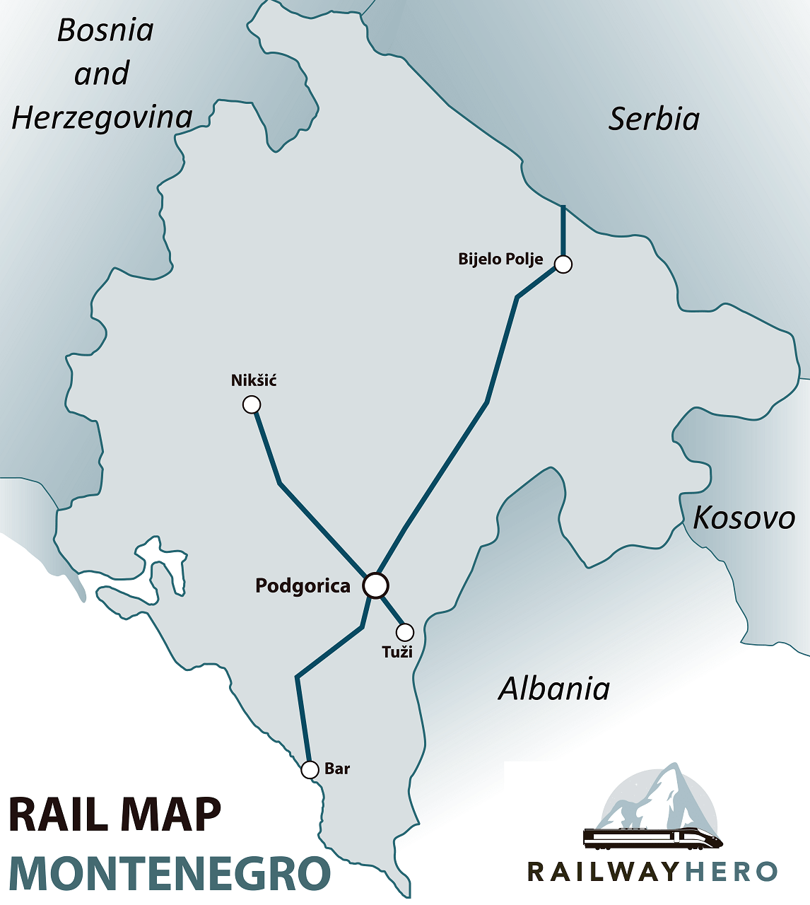

# Montenegro Railways Timetable Bot

A Telegram bot that simplifies finding train timetables in Montenegro.

**[@Monterails_bot](https://t.me/Monterails_bot)**

Original timetable is available at: - https://zpcg.me/search

# Requirements

1. Ensure it's straightforward and user-friendly to the greatest extent possible
    1. Provides a menu with all available commands
    2. Has a start message with brief and complete description of how to get the timetable
    3. Returns the requested timetable even if the user made a typo
    4. In case of an error returns message with a detailed description of how to resolve the issue
    5. Has enough logging to check if the users reach their goals
    6. Recognizes latin and cyrillic alphabet
    7. Provides additional information:
        1. Stations map
        2. Official website links
        3. Last update time
2. Has a full, updated timetable
    1. Parses original website automatically
    2. Knows every single station
3. Cost-effective as much as possible
    1. Runs in the cloud
    2. Uses tg webhooks
    3. Scales up/down automatically
    4. Runs on 1~2 thread cpus with minimum RAM available on the cloud
    5. Uses only in-memory storage, no external database or cache
    6. Fully stateless, no persistence at all

# Solution details

## Interface

### Commands

#### /start

`/start` is the first command received when a user activates the bot. It returns a quick,
laconic instructions of how to use the bot.

Returns the message in different languages depending on the user's Telegram settings.
If the user's language is not supported, it uses English for communication.

#### /help

Returns FAQ

#### /map

Prints a link to the map with all stations: https://goo.gl/maps/jYRwCAC14mmoe4L3A

#### /about

Gives links to this project and the license description

### Timetable request

Any message without a `/` is parsed as a timetable request.

Let's introduce two definitions:

`{delimiter symbol}` - one of !@#$%^&*()_+-=[]{}|;':",./<>? chars

`{departure/arrival station name}` - any number of Latin chars. It may contain chars except for delimiter
symbols, but they will be ignored

The request is expected to be in following formats:

`{departure station name} {delimiter symbol} {arrival station name}`

or

`{departure station name} {delimiter symbol} {any number of any chars} {delimiter symbol} {arrival station name}`

Messages in the expected format receive a timetable. For any other format, there will be an error.

The default error is defined in `/internal/service/render/{language_code}/*.go` files.

If the input message is in the right format but contains a station name from the black list defined in
`/internal/service/blacklist` - it is responded with a custom warning usually telling the user
that the station does not exist.

#### No intersections

Response with a route without an intersection is in the following format:

```
 Podgorica > Danilovgrad
[7100](...) 08:00 > 08:29 
[7102](...) 12:50 > 13:19 
[7104](...) 15:35 > 16:04 
[7106](...) 18:30 > 18:59 
[7108](...) 21:45 > 22:14

{inline button with a link to the route on zpcg.me}
```

1. Header contains two station names (departure > arrival) written as in the official timetable
2. Headers' delimiter character '>' is aligned to match the timetable character if possible
3. Following rows contain a train number with a link to the official timetable, departure time from the
   departure station and departure time from the arrival station
4. Rows are sorted in ascending order by the departure station time
5. The entire message uses a monospace font to make it possible to match the indent of the header and
   the timetable rows
6. Inline button is shown under the message

#### With an intersection

A response for a route with an intersection follows this format:

```
Virpazar > Podgorica > Nikšić
[6100](...) 05:43 > 06:19 
[6150](...) 06:55 > 07:26 
[7100](...)         08:00 > 09:03 
[6152](...) 09:51 > 10:22 
[6154](...) 12:08 > 12:39 
[7102](...)         12:50 > 13:53 
[6156](...) 14:41 > 15:12 
[7104](...)         15:35 > 16:38 
[6102](...) 16:03 > 17:06 
[6158](...) 17:35 > 18:06 
[7106](...)         18:30 > 19:33 
[6104](...) 18:25 > 19:15 
[7108](...)         21:45 > 22:48 
[6160](...) 21:29 > 22:00

{inline button with a link to the first route on zpcg.me} {inline button with a link to the second route on zpcg.me}
```

The format is the same as for the route without intersections but:

1. There are three columns for the times: departure time from the departure station,
   departure time from the intersection station and the departure time from the arrival station
2. Rows are sorted by the time of the intersection station
3. The message has two inline buttons for each route link

### Error message

The error message repeats to the user the format of the timetable request. Example:

```
Try again - two stations, separated by a comma. Just like that:

Podgorica, Niksic
```

## Backend

### Path finding algorithm

The bot uses its own path finding algorithm. It does not use Dijkstra to solve the problem.

It is built with some assumptions listed below.

#### Assumptions



Railway system of Montenegro consists of:

- Main station Podgorica
- Podgorica - Bar branch
- Podgorica - Niksic branch
- Podgorica - Belgrade branch (through Bijelo Polje)
- Podgorica - Tuzi (and further to Durrës/Tirane, Albania. This branch is fully abandoned and is not in use)

So the assumptions are:

1. Each train passes every station in its route only once.
2. For any two stations there is a straight route or a route with an intersection in Podgorica station.
   This means the Podgorica station might be used as the only intersection station. Also, there are no routes
   with two or more intersections.
3. Routes without intersections are always faster (or just preferred) than those with one or more.
4. Routes with an intersection in Podgorica are always preferred than the routes with any other.
5. The Montenegro railway system is an acyclic undirected graph. This means that for every train station,
   trains can travel in any direction, and it is impossible to circle from a station back to itself
   without repeating stations.

This means, that it is completely enough to return only one of two types of routes for every possible input:

1. Straight route
2. Route with exactly one interchange in Podgorica

#### Future-proof

Conditions that might disrupt the assumptions include:

- If the timetable includes a train not passing through the Podgorica station
- If the railway system has a route with any other preferred interchange station other than Podgorica
- If a cycle occurs in the graph

Possible improvements to this railway system might involve:

Extending the Podgorica - Belgrade branch to the Subotica station and beyond to Hungary, in light of Subotica
being mentioned in the [official timetable](https://www.zcg-prevoz.me/search) and the Subotica - Szeged rail line is now
[reopened](https://www.railwaypro.com/wp/subotica-szeged-rail-passenger-services-resumed/). It may add new stations
to the branch but is not going to create a cycle. Some kind of fork might be added which means there might be another
preferred intersection point for trains going from Hungary to Serbia, but it is obviously outside the context of
the Montenegro timetable bot.

The same applies to the possible renovation of the Podgorica - Tuzi - Durrës/Tirane branch and an extension of
the Podgorica - Niksic line to the Sarajevo.

It means we can easily rely on the assumptions listed above in order to optimize the path finding algorithm.

#### Steps

1. **Preparation: needed data structures**
    1. **StationIdToTrainIdSetMap**: map: station -> set of train ids

       This field is a map where each key is a StationId and each value is a set of TrainId.
       This map allows the PathFinder to know which trains depart from any given station. This information is essential
       for
       identifying possible routes when calculating the paths between two stations.

       Train ids are unique and for every station exist a set of trains that passes the station. Consequently, it is
       possible to fill this structure correctly.

    2. **TrainIdToStationsMap**: map: train id -> (set of stations -> {station name, arrival time, departure time})

       This field is also a map. Each key is a TrainId and each value is a StationIdToStationMap
       that contains every station that the train stops at. This map is important to derive the sequence of stations
       that
       each train traverses along its route.

       According to the assumptions, every train passes each station of its route only once. That makes possible to
       build a set of route stations with details about the arrival/departure time.

    3. **TransferStation**: station id for the interchange station

       This field represents a predefined station which serves as the only transfer point in case there are no direct
       paths available between two requested stations.

2. **Check for Direct Path**

   Find a direct path/route from station A (aStation) to station B (bStation).
   "Direct" here means there are trains which go from station A to station B without the need for a transfer.

   It is done by first checking which trains serve both the station A and station B using the
   predefined StationIdToTrainIdSetMap:
   ```go
       trainIdSetA = p.stationIdToTrainIdSetMap[aStation]
       trainIdSetB = p.stationIdToTrainIdSetMap[bStation]
       // get intersection of maps of the trains 
       possibleRoutes := utils.Intersection(trainIdSetA, trainIdSetB)
   ```
   If the set intersection is not empty - the directs paths are found.

   The final result is defined by validating if the train/s found have a schedule such that it/they depart/s
   from station A and arrive at station B consecutively. This information might be found using prepared
   TrainIdToStationsMap. If the condition is met, then this direct path is valid and is added to the returning paths.

   We assume that the direct paths are the preferred ones, so there is no need to look for another paths.

   The problem is solved.

3. **Check for Indirect Path**

   If no direct path is found, paths with a transfer needed to be found. This is the step where the predefined
   Transfer Station is being used.

   In this step the algorithm essentially performs a two-part journey - first it finds the paths from station A
   to the Transfer Station, then it finds the paths from the Transfer Station to station B the same way as it was done
   in the previous step. These possible routes are merged together in a specific manner, in case of overlapping
   schedules,
   the route which arrives at the transfer station before the departure to station B is preferred.

   We assume that the path through the Transfer station always exists and is the most suitable.

4. **Returning Paths**

   Finally return the paths found and a bool flag indicating whether the
   found routes are direct or not.

#### Complexity

In the first step, the algorithm iterates over each train in a set which contains the intersection of trains
at station A and station B. The intersection operation would have a time complexity of O(n), where n is the number of
elements in the larger train set. Then, for every train, it checks the conditions and possibly appends it to the paths.
Adding all of this up, the time complexity of this operation can be considered to be O(n).

In the second one, the algorithm repeats step one twice, so that would be 2*O(n) ~ O(n). Then it iterates through the
lists
of direct paths from station A to the transfer station and from the transfer station to station B, merging these paths
as it goes. This merger can, in the worst case, have a time complexity of O(n + m), where n and m are the lengths of the
two lists. Adding these together, the overall time complexity could be considered to be O(n + m) where n is the number
of elements in the larger set and m is the total number of paths.

The space complexity of the algorithm comes primarily from the storage of the 'paths'. In the worst case,
it could potentially store each direct path from the source station to the destination, as well as each path
via the transfer station. This gives a worst-case space complexity of O(n + m), where n and m are the numbers of
direct and transfer paths, respectively.

Please note: In these analyses, m and n are not necessarily numbers of stations or trains but rather the number
of paths and matches the algorithm needs to keep track of. Thus, the actual time or space this algorithm takes might be
different based on the specific graph structure of the train network.

Also, the memory requirement of the StationIdToTrainIdSetMap and TrainIdToStationsMap structures scale linearly with
the overall increase in the number of stations and trains. The exact growth can be viewed as O(n) and O(m) respectively,
where 'n' is the number of train services and 'm' is the number of stations.

Therefore, the algorithm has a linear time and space complexity.

### Exporter

Exporter: `cmd/exporter`

The Exporter prepares the necessary data structures for finding routes. It parses
the [official site](https://zpcg.me/search)
and saves these structures as a Go code file in `gen/timetable/timetable.gen.go`. The entire timetable is then compiled
directly into the executable file, making it accessible without any additional steps.

### Telegram bot

Initializer: `cmd/tg-init`
Server: `cmd/tg-server`

The bot waits for HTTP requests from Telegram, handles and sends messages to users. It runs on the Google Cloud Run
platform,
invokes on every request (i.e. is not running all time long) which makes it cost-effective.

It is running on the smallest cpu and memory available: 1 vCPU and 128Mb RAM. And uses usually no more than 15% of this
memory.

The life cycle is simple:

1. A user request is received. If there are no running instances of the bot - a new one is started. It takes less than a
   second to wake up and response correctly to a live probe.
2. Request is handled, route is generated, reply message is sent. It takes about 200ms.
3. If there is no more requests for ~15 minutes - Cloud Run automatically scales it all down

The request handling time (~200ms) is the only billable time in this lifecycle. The overall cost of the bot right now
is about ~0.03 euros per month with 100~150 users and ~500 user requests per 30 days.

The bot is almost free to maintain and as cost-effective as possible.

# Ways to improve

This project might be improved in several ways in order to meet the requirements listed above.

### Keyboard

"I prefer clicking buttons over a raw keyboard input" - this is a common feedback I get from users. Implementing
keyboard is a great way to improve UX. But how can the implementation still be stateless and fast enough then?

[Force reply feature](https://core.telegram.org/bots/api#forcereply) is going to be helpful for that.

### Telegram WebApp

Additional info (price, route stations, ticket offices working hours, etc.) might be provided. But it is impossible
to present all this in one small message. It might be done
using [WebApps](https://core.telegram.org/bots/features#web-apps) feature
and [GitHub Pages](https://github.com/revenkroz/telegram-web-app-bot-example) as a host.

### Other platforms

Telegram bots API is powerful, but the Telegram itself is mostly used by foreigners. In Montenegro
Viber is widely used and WhatsApp is the best option for any other tourists or foreigners. It is a good idea to
port this solution to other platforms in order to reach the audience.

ZPCG has a [Viber chat](https://www.zcg-prevoz.me/Informisanje-o-redu-voznje-vozova-putem-aplikacije-Viber.html)
to get info about the timetable. But it replies to messages only on working days from 07:00 to 15:00, probably
because
there is a person behind the scenes that is answering all the questions. I think it is a good idea to provide the same
service
but working fast and 24/7.
