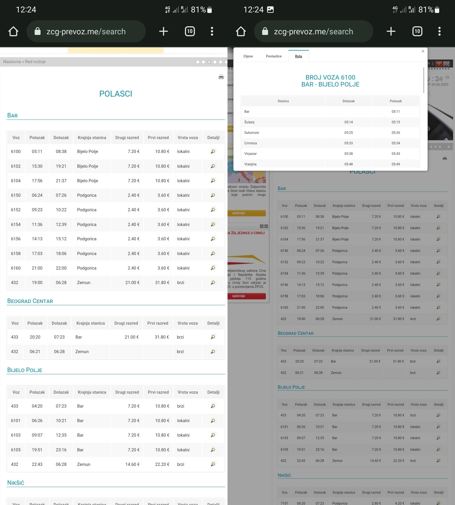
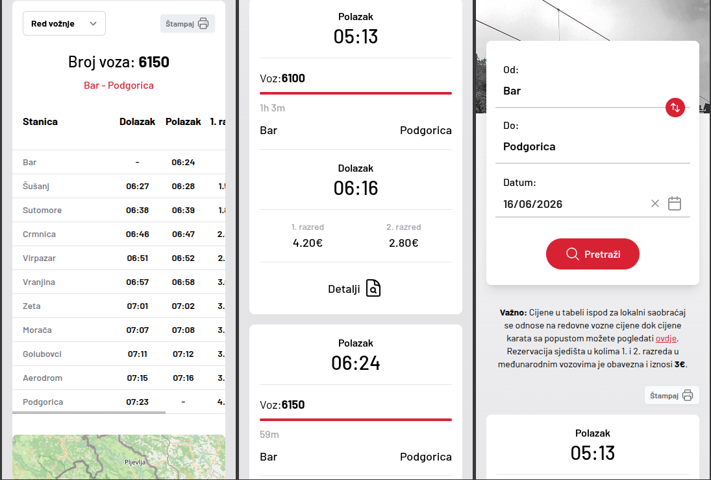
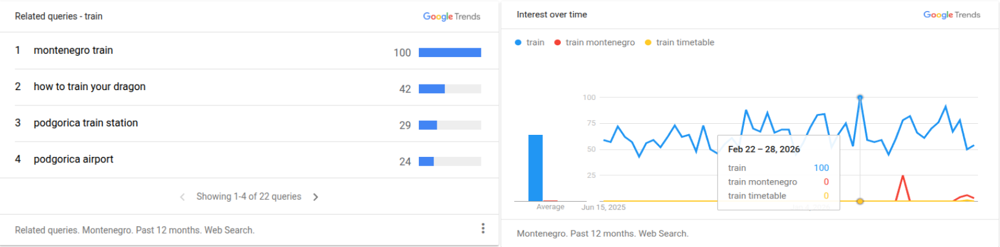
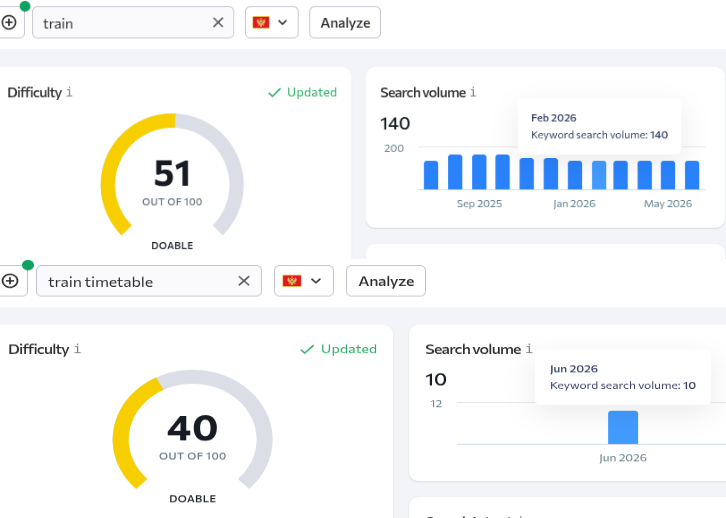

# Overview

An overview of the reasons behind this project and expectations being set for the solution.

## The problem

Montenegro Railways (ZPCG) publishes its timetable through a web interface optimised for desktop browsers.

This is what it looked like before an update in 2024:

And this is what it looks like now ([zpcg.me](https://zpcg.me)):

An android app is available to download, but it is not actively maintained and distributed as an .apk file
via https://api.zpcg.me/storage/downloads/ZPCGTimetable.apk .

As a result, there is:

- No convenient way to look up the timetable on mobile devices
- No functionality to save it for offline use except by manually making a screenshot
- No option to save routes to favourites and update them automatically, without navigating to the website

## The solution

### Telegram bot

For travellers already on a platform like Telegram — the dominant messaging app among tourists and expats in
Montenegro — this creates unnecessary friction at exactly the moment they need the information. The timetable can be
requested from a bot in a single message, updated in one click and saved for offline use. The goal of this project is
to close that gap.

### No monetisation expected

The bot saves a user one or two clicks over visiting the official website. The timetable is free and publicly
available - there is no reason for charging for access to it. Monetisation is not a realistic option and should not be a
goal.

This means all infrastructure must be as cost-effective as possible. It must come by design, not by luck.

### Traffic estimation

Let's estimate expected traffic. According to Google Trends, the most popular search term related to railway timetables
is "train".

SE Ranking estimates search volume for "train" - the broadest relevant term - to be around 140 requests per month and
for "train timetable" to be
around 10 requests per month.

With that in mind, we can assume that no more than 200 users per month will be using the bot. It's about 7 users per
day or 1 user per hour.

This sets a realistic upper ceiling: the bot is unlikely to exceed the total search demand for the topic it serves.
Infrastructure must scale to zero at low traffic and scale up to the expected demand at high traffic.
**Post-launch proved this estimate was accurate:** the bot has been running at maximum ~500 requests/month since
deployment.

### Scope and constraints

The aim is to conveniently look up the timetable on mobile devices with these constraints in mind:

- Zero operational cost target. The service must be sustainable on a personal budget indefinitely, meaning
  infrastructure
  costs should be negligible at the expected traffic volume (~200 requests/month).
- Zero maintenance burden. No databases to manage, no caches to invalidate, no background jobs to monitor. Every moving
  part is a liability at this scale.
- No control over the data source. The upstream ZPCG website is scraped, not integrated via API. The timetable changes
  seasonally and without notice.

What is explicitly out of scope:

- Real-time train tracking or delay information — ZPCG does not expose this.
- Ticket purchasing or booking — there is no online service like this in Montenegro at all.
- News, concierge services or other services that are not related to the timetable.

We only show the updated timetable in a fast and reliable way. Period.
