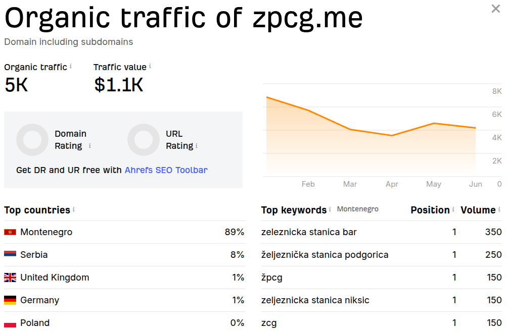

# Overview

An overview of the reasons behind this project and expectations being set for the solution.
See [the 2-system-design.md](2-system-design.md) document for a list of requirements and design decisions.

TL;DR - the expectations are:

- A telegram bot
- No dependency on the unreliable data source (the official site zpcg.me).
- Zero operational cost target. State-free, scalable architecture.
- Zero maintenance burden. No databases to manage, no caches to invalidate, and no background jobs to monitor.
- Fully deterministic, with no dependency on external services.

## The problem

Montenegro Railways (ZPCG) publishes its timetable through a web interface optimised for desktop browsers.

This is what it looked like before an update in 2024:

And this is what it looks like now ([zpcg.me](https://zpcg.me)):

An android app is available to download, but it is not actively maintained and distributed as an .apk file
via https://api.zpcg.me/storage/downloads/ZPCGTimetable.apk .

As a result, there is:

- No convenient way to look up the timetable on mobile devices
- No functionality to save it for offline use except by manually making a screenshot
- No option to save routes to favourites and update them automatically, without navigating to the website

## The solution

There are several ways to show the timetable on mobile devices:

1. An app
    - (-) needs both frontend and backend to build and maintain
    - (-) needs distribution via Google Play Store and App Store, or as a web-app.
2. A website
    - (-) no offline functionality
3. A messenger bot
    - (+) needs only a backend
    - (+) a timetable can be saved for offline use in a chat and send to other users
    - (+) easier distribution - just register a bot without any extra steps

Thus, the solution is **a messenger bot**.

### Platform of choice - Telegram or Viber

There are 3 options:

1. Viber
    - (+) the most popular messenger in the Balkans
    - (-) Per-message fee of 0.0113 €
    - (-) Monthly fee of 100 € (see https://www.forbusiness.viber.com/en/chatbots/)
2. WhatsApp
    - (+) the most popular messenger among tourists
    - (-) Per-message fee of €0.0175 € (see https://whatsappbusiness.com/products/platform-pricing)
3. Telegram
    - (+) the most popular messenger among expats
    - (+) no fees
    - (+) rich documentation and support
    - (+) webapp support - bigger room for growth

Telegram is a good start choice: no fees, feature-rich, and well-documented. But it lacks audiences in Montenegro.
A better choice for higher traffic is Viber, but the 100 € fee must be justified thoroughly.

### Ways of monetisation

The bot can save a user one or two clicks over visiting the official website. The timetable is free and publicly
available - there is no reason for charging for access to it, i.e. subscription model seems unreasonable. However,
we can show ads relevant to the search terms. In this case, we'll need to have enough traffic to make the ads worth
it.

Adding ads might be a good idea, but only with enough traffic.

### Traffic estimation

Let's estimate expected traffic.

We have two ways:

1. The official website traffic statistics - zpcg.me
2. Search volume for related terms

#### The official website traffic statistics - local traffic estimates

According to https://ahrefs.com/ the official website has:

- 5K monthly pageviews
- Most of the traffic is from Montenegro and Serbia (97% together)
- The top keywords for the search are in Montenegrin/Serbian languages with overall 1150 searches per month from locals:
    - zeleznicka stanica bar - 350 searches per month
    - željeznička stanica podgorica - 250 searches per month
    - žpcg - 150 searches per month
    - zeljeznicka stanica niksic - 150 searches per month
    - zcg - 150 searches per month

The approximate ceiling for the traffic is 5K monthly pageviews, mostly people from Montenegro and Serbia speaking in
Montenegrin and Serbian languages. Since the traffic is mostly from Montenegro and Serbia, the Viber bot is a much more
suitable platform for the bot than any other - Viber is the most popular messenger in Montenegro.

#### Search volume - tourists and expats traffic estimates

In the previous section we made an estimation for the Montenegrin and Serbian traffic. Now we need an estimation for
traffic from tourists and expats. According to Google Trends, the most popular search term related to railway timetables
in Montenegro is "train".

SE Ranking estimates search volume for "train" - the broadest relevant term - to be around 140 requests per month and
for "train timetable" to be around 10 requests per month.

With that in mind, we can assume that no more than 140 foreign users per month will be using the bot. It's about 5 users
per day or 1 user per 5 hours.

Let's assume a user makes 4 requests monthly: 1 to get the timetable to a destination, 1 for a route back, and 2 more to
update the timetables on another day. Then, the total **maximum expected traffic** is
4 * 140 = **560 requests per month** or 20 requests per day, **1 request per hour**.

**Post-launch proved this estimate was accurate:** the Telegram bot has been running at maximum ~500 requests/month
and ~100 unique users/month since deployment. The audience is almost 100% made up of foreign users.

## Bottom line

We have 2 options:

1. Make a Viber bot with high traffic and ads, but with high operational costs.
2. Make a Telegram bot with much lower traffic, no ads, but no fees to pay, having only infrastructure costs.

It seems reasonable to start with the second option and, move to the first one later.

Then, we have the following expectations:

- A telegram bot
- No dependency on the data source. From personal experience, the official site is unreliable. But there is no need to
  use its API as a dependency: the timetable changes seasonally, only 3 times a year, which makes possible to save it
  once and serve year-round.
- Zero operational cost target.
- Zero maintenance burden. No databases to manage, no caches to invalidate, and no background jobs to monitor.
- Scalability. Being fully deterministic, with no dependency on external services, it is possible to easily scale the
  infrastructure down to zero to reduce costs and scale up on demand.

What is explicitly out of scope:

- Real-time train tracking or delay information — ZPCG does not expose this.
- Ticket purchasing or booking — there is no online service like this in Montenegro at all.
- News, concierge services, or other services that are not related to the timetable.
