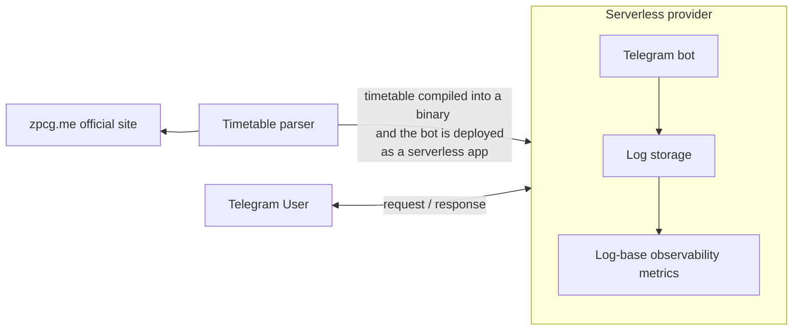

# System Design

See [1-overview.md](1-overview.md) for the reasons behind this design.

## Functional requirements

1. It's a Telegram bot
2. Provides a menu with all available commands
3. Simple commands for providing general information:
    1. `/start` - a start message with a brief and complete description of how to get the timetable
    2. `/help` - frequently asked questions
    3. `/map` - a railway map
    4. `/about` - a brief description of the bot and the link to the source code
4. A user sends a message with a timetable request: "Podgorica, Bar"
    1. The bot must recognise both Latin and Cyrillic alphabet
    2. If the input is valid, i.e. contains exactly two stations (departure, arrival) - the bot responds with an
       up-to-date timetable
    3. If the input contains some minor typos, the bot corrects them and responds with an up-to-date timetable
    4. If the requested station is not found or does not exist - the bot responds with an error message
    5. If the input is invalid - the bot responds with an error message
5. The response with a timetable
    1. Contains the departure and arrival times for all trains on the route, sorted by the departure time
    2. Shows the last update time
    3. Has a link to the timetable on the official website

## Non-functional requirements

### Availability

Best-effort availability overall: no SLA, no on-call, no redundancy guarantees.
Resilience must come from having no runtime dependencies, not from redundancy or monitoring.

But one guarantee is required - even if the zpcg.me website is down, the bot must still be available.

### Scalability

As stated in the [1-overview.md](1-overview.md#traffic-estimation) file, we expect low traffic,
around 1 request per hour. The bot must be able to scale down to zero and scale up automatically on demand.

### Latency

Response time should be around 300ms on average with a maximum of 1-2 seconds.

### Durability

We do not expect the bot to store any user data, so no durability constraints are provided.

### Read to write ratio

The timetable changes only 3 times a year, while requests are serviceable every day. No user data is stored, so no
write operations are expected. 100% read-only architecture.

### Retention policy

All observability metrics should be stored for 30 days.

### Costs

Infrastructure cost must remain insignificant (no more than 1€ per month) at expected traffic.

## High-level design

### API

Only one API endpoint for receiving requests from Telegram webhooks.

```http request
POST /
X-Telegram-Bot-Api-Secret-Token:    # (optional) a predefined secret token. See http://core.telegram.org/bots/api
content-type: application/json

{
    "update_id": integer,
    "message": jsonObject,          # if a user sends a message. see https://core.telegram.org/bots/api#message
    "callback_query": jsonObject    # if a user presses a callback button. see https://core.telegram.org/bots/api#callbackquery
}

response:
200 OK
500 Internal Server Error           # telegram will retry the request in this case
```

### Data modeling

No persistent storage, no runtime dependencies fully stateless architecture.
All necessary data is parsed from the official site once/several times a year and compiled right into the binary.

### Estimates

According to the [1-overview.md Traffic estimation](1-overview.md#traffic-estimation), we expect around 600 requests per
month. No user data is stored, only observability metrics for 30 days.

#### Request processing

We expect:

1. **600 requests per month**
2. No more than 2 seconds per request, which means no more than 2*600 = **1200 CPU-seconds per month**

Also, we need in-memory storage for ~100 stations of Montenegro's railway network. Assuming a station must
contain a cyrillic name (~10 chars = 10 bytes), latin name (~10 chars = 10 bytes) and a station ID (int64 = 8 bytes),
we can expect (10 + 10 + 8 bytes) * 100 = 2800 bytes = **2.73KB of memory**.

A timetable has ~30 trains, each of them containing an array of stations (let's assume 50 stations per train) with
a station Id (int64 = 8 bytes), a departure time and an arrival time per each station (int64 per timestamp = 8 bytes per
timestamp). With that said:

30 trains * 50 stations * (8 bytes (station Id) + 8 bytes (departure time) + 8 bytes (arrival time)) = 36,000 bytes ~
**36KB of memory**.

2.73KB + 36KB ~ 39KB of memory for the timetable is needed.

Having no more than 2 seconds per request and 600 requests per month, we can expect 46,800 KB ~
**46 MB-seconds of memory** billed monthly.

Let's take the GCloud Run [pricing](https://cloud.google.com/run/pricing) as an example:

> Services (Requests-based billing)
> Services with request-based billing during billed instance time
>
> Free tier (based on us-central1 active pricing):
>
> CPU - First 180,000 vCPU-seconds free per month
> RAM - First 360,000 GiB-seconds free per month
> Requests - 2 million requests free per month

The request processing is **free of charge.**

#### Storage

In our case it is enough to write a log line for every incoming request, since we do not expect high traffic, then parse
them into log-based metrics like:

- number of requests
- number of unique users
- average response time
- number of errors
- number of successful requests
- etc.

A log line should include:

- request time - a linux timestamp like `2000-01-01T00:00:00.000000000Z` - **30 characters**
- request type (e.g. message or callback) - a string like `message` or `callback` - **7 characters**
- unique user ID - a string like `123456789` - **10 characters**
- response status code - a string like `200` or `500` - **3 characters**
- response time - a linux timestamp like `2000-01-01T00:00:00.000000000Z` - **30 characters**
- input message - a string like `/start` or `Podgorica,Niksic` - **20 characters**
- output message - a string with ~20 lines (route name and every train schedule), each ~100 characters long - **2000
  characters**

Summary: **2100 characters per line (= per request)**. Each character is a UTF-8 1 byte symbol, then a line is 2100
bytes.
With 600 requests per month given, we can expect 2100 * 600 = 1,260,000 bytes =
**1.2 MB of logs storage per month needed**.

GCloud Logging storage for example is **free of charge for the first 50 GiB/project/month** and Log Analytics comes
with 'No additional charge' (see [pricing page](https://cloud.google.com/products/observability/pricing#storage-model)).

The storage is **free of charge** also.

## Low-level design



1. Timetable parser - an app that parses the official site and prepares the data to be compiled into the bot's binary.
2. Bot - a serverless app that receives requests from Telegram webhooks and responds with a timetable.
3. Serverless provider - a cloud provider that runs the bot as a serverless app.

With this architecture:

- The bot has no runtime dependencies - it is a statically compiled binary. No database, no cache and no zpcg.me API
  calls for a timetable. Perfect for our [availability requirements](#availability)
- No need for storing any state, which makes the bot easily [scalable](#scalability)
- Zero network latency, since we do not use any external services. Easy to fit in
  our [low latency requirements](#latency).
- While read requests are cheap, since we use a serverless approach, write timetable-update requests require
  redeploying the bot. In the worst-case scenario, it happens 3 times a year and results in no downtime because
  cloud providers allow redeploying serverless apps without affecting the traffic in any way.
