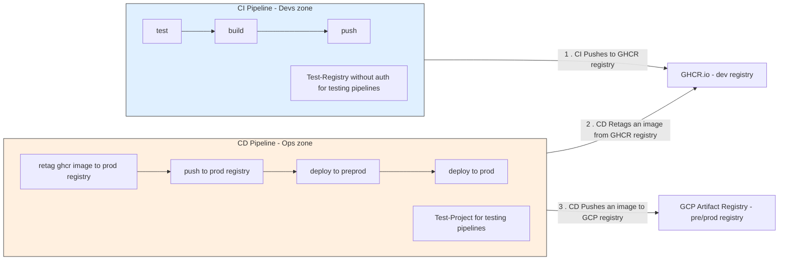
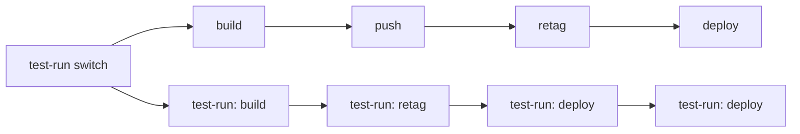
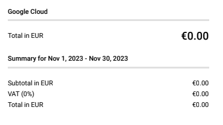
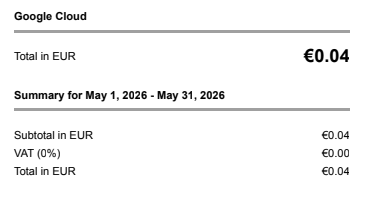

# Operational Profile

## Deployment

### CI and CD

All pipelines are strictly divided into two parts: CI and CD. CI is intended to be devs responsibility - tests, linting,
any other pr checks, and final image build. CD is intended to be run by the devops team - fetch the image from the
devs registry and deploy it to the production environment.

Devs team responsibility zone - devs are free to modify any of the things below:

1. GitHub GHCR.io registry
    1. This is the only registry that devs can push to
    2. Anyone can pull from this registry
    3. Only semver tagged images are meant to be used in pre/production environments
2. GitHub Workflows with `ci-` prefix

For every pre/release a semver tag is created and an image with the same tag is pushed to the GHCR registry. This is the
only artifact that the operations team pulls.

Operations team responsibility zone - ops are free to modify any of the things below:

1. GCP Artifact Registry - pre/prod registry.
    1. A clean room for production images.
    2. Only semver tagged images are meant to be used in production environments.
    3. No access to the dev team - ops-only zone.
2. GitHub Workflows with `cd-` prefix.
3. GCloud Run services and other cloud infrastructure.

With this said, the only common part of the pipelines is the explicitly prod-ready tagged artifact.
It allows us to have a clean separation between the devs and ops teams.



Every workflow has two branches: for default execution and test runs. It helps with testing the pipelines in isolation,
both locally and in GitHub Actions.



<details>
<summary>Implementation example:</summary>

```yaml
jobs:
  - switch:
      outputs:
        test_run: ${{ steps.test_run_switch.outputs.test_run }} # true or false
      steps:
        - # decide - default or test-run mode
        - # set outputs.test_run to true or false 
  - deploy:
      name: Deploy to preprod
      needs: [ switch ]
      if: ${{ needs.switch.outputs.test_run != 'true' }} # depends on the switch
      env: &deploy-env        # env anchor
      # ...
      steps: &deploy-steps    # steps anchor
      # ...

  - deploy-test-run:
      name: (test-run) Deploy to preprod
      needs: [ switch ]
      if: ${{ needs.switch.outputs.test_run == 'true' }}
      environment: test-run   # test environment
      permissions:
        registry: read       # protects from accidental writes
      env: *deploy-env        # same envs
      steps: *deploy-steps    # same steps
```

</details>


See [the full CI / CD](/.github/README.workflows.md) workflow guide for more details.

### Environments

The project runs locally, in pre-production and production environments.

#### Local

The most convenient way to test and debug the project locally is to run a subset of tests:

- e2e tests under `/test` directory for testing the server as a whole
- integration tests under `/internal/app` for testing business logic without HTTP server calls
- unit tests under `/internal/...` for testing the business logic of a single package

A go package `github.com/zelenin/go-tdlib/client` allows to use Telegram Database library (https://github.com/tdlib/td)
to test the bot as precisely as possible.

#### Preprod

As a pre-production environment, the project is deployed to a different Cloud Run service with
its own telegram bot. It allows us to test the project in a realistic environment.

https://t.me/TESTCrnaGoraTrainTimetableBot

Deployment starts after a GitHub pre-release is created. Only images with a `*.*.*-rc*` (release candidate) tag are
allowed in preprod.

#### Prod

https://t.me/Monterails_bot

Semver tagged images only, without `rc` suffix. Deployment starts after a GitHub release is created.

## Release & Rollback

Releases are done automatically by GitHub Actions. It only takes to trigger a release workflow by creating a release.

Rollback is supported - Cloud Run automatically resets the instance to the previous version if the liveness probe fails.
Manual rollback is also an option.

## Runtime & Resource Profile

It is running on the smallest cpu and memory available in Cloud Run: 1 vCPU and 128Mb RAM.
Uses no more than 15% of this memory, ~20Mb RAM and no more than 10% of this CPU.

The life cycle is simple:

1. A user request is received. If there are no running instances of the bot - a new one is started. It takes less than a
   second to wake up and respond correctly to a live probe.
2. The request is handled, a route is generated, and a reply message is sent. It takes about 200ms.
3. If there are no more requests for ~15 minutes - Cloud Run automatically scales it all down

The request handling time (~200ms) is the only billable time in this lifecycle.

## Observability

As mentioned in [the system design doc](2-system-design.md), observability comes from logging and
log-based metrics. One log line represents a single request with all the necessary information:

- Request and response timestamps
- Request type (e.g. 'message' or 'callback')
- User's input and bot's response
- Error message if any
- Additional information like user's ID, update ID, etc.

Since the project doesn't have any high-volume traffic and doesn't use any external services, this approach is
sufficient for monitoring:

- every warning or error event is logged and can be easily used for alerting.
- request count and response time are logged. It is sufficient to monitor the response time and general availability.
- no need for additional log aggregation with external services. The bot produces ~20 logs per day, which is easily
  readable without any additional processing.

## Failure Recovery

The bot is designed to be resilient. It doesn't have any external dependencies, like databases, cache or external APIs
(like zpcg.me).
Only three types of failures are expected:

1. Bot's logic failure
2. GCloud failure
3. Telegram platform failure

In case of the issues, several options are available:

1. Business logic failure - rollback to the previous version of the bot - the fastest way to resolve an emergency.
   If /liveness probe fails after a new version rollout, the rollback is performed automatically.
   If a manual rollback is needed - it takes only a few clicks in the GCloud Console. Then create a hotfix release.
2. GCloud failure - redeploy the current version to another region or availability zone. Needs a few steps:
    1. A push from the GHCR.io registry to a GCP Artifact Registry repository in another region
    2. Some changes in the Cloud Run service configuration to point to the new image and to run in a different region
    3. Update GitHub Actions secrets to point to the new GCloud region
    4. Run the deployment workflow or deploy manually
    5. Update Telegram bot's webhook URL
3. Telegram Platform failure - there is no way to recover from it. Telegram is an essential part of the bot.

The path for GCloud failure (2.) exists but has never been exercised in production. Since the very first version of the
bot released in January 2024, it has been running without any major issues.

## Cost

First invoices from the Google Cloud had zero costs, exactly as estimated
in [the system design docs estimates](2-system-design.md#estimates).



At some point, the project started to use GCP Artifact Registry more extensively for storing images. It led to
a slight increase in costs - 0.04€ per month.



But it is still a very small increase, which is acceptable for the project. It meets
our [cost expectations](2-system-design.md#costs).

The overall cost of maintaining the bot
right now is about 0.04 euros per month with 100-150 users and ~500 user requests per 30 days. The required 1€ per month
[budget](2-system-design.md#costs) is more than enough for the project.

The bot is almost free to maintain and as cost-effective as possible.
